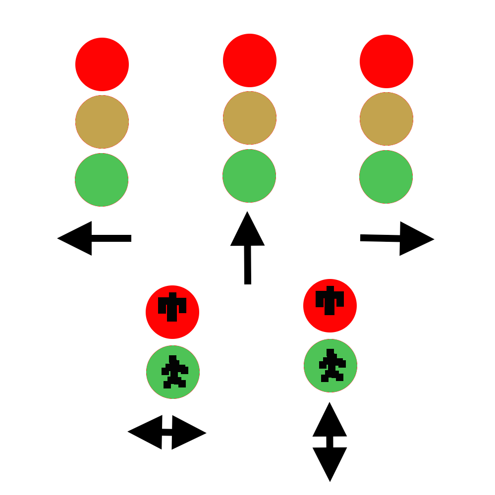

# System of traffic lights and raspberry pi for air quality estimation
## opensource - system of traffic lights and air quality estimation using raspberry pi

## Περιγραφή

Ο σκοπός του έργου είναι να φτιαχτεί ένα σύστημα φαναριών που θα ρυθμίζει την κυκλοφορία σε έναν κόμβο και ταυτόχρονα παίρνει περιβαλλοντικές μετρήσεις. Έχει χρησιμοποιηθεί ένα raspberry pi για κάθε φανάρι, το οποίο είναι υπεύθυνο για τις λάμπες του φαναριού του. Σε κάθε κόμβο, υπάρχει ένα συντονιστής, στον οποίο συνδέονται τα raspberry για να πάρουν την τρέχουσα κατάστασή τους. Επιπλέον, ο συντονιστής μπορεί να έχει ένα airpi και να παίρνει μετρήσεις για την ποιότητα του αέρα. Με αυτό τον τρόπο μπορούμε να δούμε αν ο κόμβος είναι πολυσύχναστος. Με βάση αυτή την ιδιότητα, θα μπορεί να χρησιμοποιηθεί για την συλλογή μετρήσεων της ποιότητας 
αέρα και του επιπέδου θορύβου σε έναν κεντρικό server. Στην  συνέχεια, αυτές οι μετρήσεις θα 
μπορούν να ελεγχθούν από εξειδικευμένο προσωπικό και να πάρουν αποφάσεις για την βελτίωση των συνθηκών στην περιοχή. Για παράδειγμα, αν ένας κόμβος έχει πολύ μεγάλη συγκέντρωση από διοξείδιο του άνθρακα για μεγάλο χρονικό διάστημα, ίσως θα πρέπει να εξεταστεί από τον δήμο να τροποποιηθεί.

## Χρήστες

Το σύστημα απευθύνεται σε:

* τοπική αυτοδιοίκηση
* τροχαία
* ΥΠΕΚΑ

Το σύστημα μπορεί να ορίσει τις καταστάσεις των φαναριών μέσω web interface, να ορίσει την αλληλουχία των καταστάσεων και να συγκεντρώσει τις μετρήσεις σε έναν κεντρικό server.

## Ελάχιστες Απαιτήσεις

Το υλικό που απαιτείται είναι:

* 4 * raspberry pi (50 euro ανά μονάδα)
* 1 * airpi (100 ευρώ ανά μονάδα)
* 1 [ρελέ](https://www.sparkfun.com/products/11042) για κάθε λάμπα (10 ευρώ ανά μονάδα)
* καλώδιαv(1 ευρώ ανά μονάδα)

Το λογισμικό βασίζεται σε LAMP (Linux, Apache, Mysql, Php). Όλα τα πακέτα λογισμικού υπάρχουν στην έκδoση [Rasbian](https://www.raspbian.org).

## Αποθετήριο
Το έργο βρίσκεται στο ακόλουθο [URL](https://github.com/ellak-monades-aristeias/system-of-traffic-lights-and-raspberry-pi-for-air-quality-estimation).
